# 数据 数据分析(一)-数据分析思维 2020-10-04

#### Create By GF 2023-08-24 21:01

#### 数据_数据分析(一)-数据分析思维_2020-10-04.md

----------------------------------------------------------------------------------------------------

这篇文章具体的给大家介绍数据分析中最为核心的技术之一——数据分析思维的相关内容。

### 一 数据分析的三种核心思维

作为新手数据分析师或数据运营，在面对数据异常的时候，好多小伙伴都会出现：“好像是A引起的” ，“好像也和B渠道有关”，“也可能是竞争对手C做了竞争动作”等主观臆测。面对数据报表，也不知道应该从产品维度、时间维度、地域维度还是渠道维度去拆分。很显然，这样的思维是乱的，所以做数据分析很重要的一点是：要具备结构化的分析思维。接下来给大家介绍数据分析的三种核心思维——结构化、公式化、业务化。

#### 1. 数据分析思维——结构化
    
在日常的生活中，当我们针对一个问题进行分析时，分析的思路总是一团乱麻？分析到一半就进行不下去了，或者分析完了也得不出一个结论，效率是极其低下的。具体的如图所示：

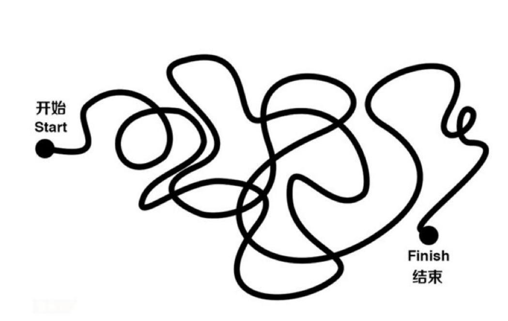

但是对于一个专业的数据分析师来说，他会针对一个问题进行系统的剖析，很快就会形成一种由点到线、由线到面、由面到体的一种思维过程，很快就会得出一个很好的结论，侠侣及其高的。具体思维过程如图所示：

例如有以下一个案例：

    现在有一个线下销售的产品。我们发现8月的销售额度下降，和去年同比下降了20%。我想先观察时间趋势下的波动，看是突然暴跌，还是逐渐下降。再按照不同地区的数据看一下差异，有没有地区性的因素影响。我也准备问几个销售员，看一下现在的市场环境怎么样，听说有几家竞争对手也缩水了，看一下是不是这个原因。顾客访谈也要做，但是往常一直找不出原因，这次我也不抱希望，姑且试试吧。要是还找不出原因，那我也很绝望啊。

针对这个案例，如果我们在没有介绍结构化之前，大部分工作人员的分析过程如下所示：

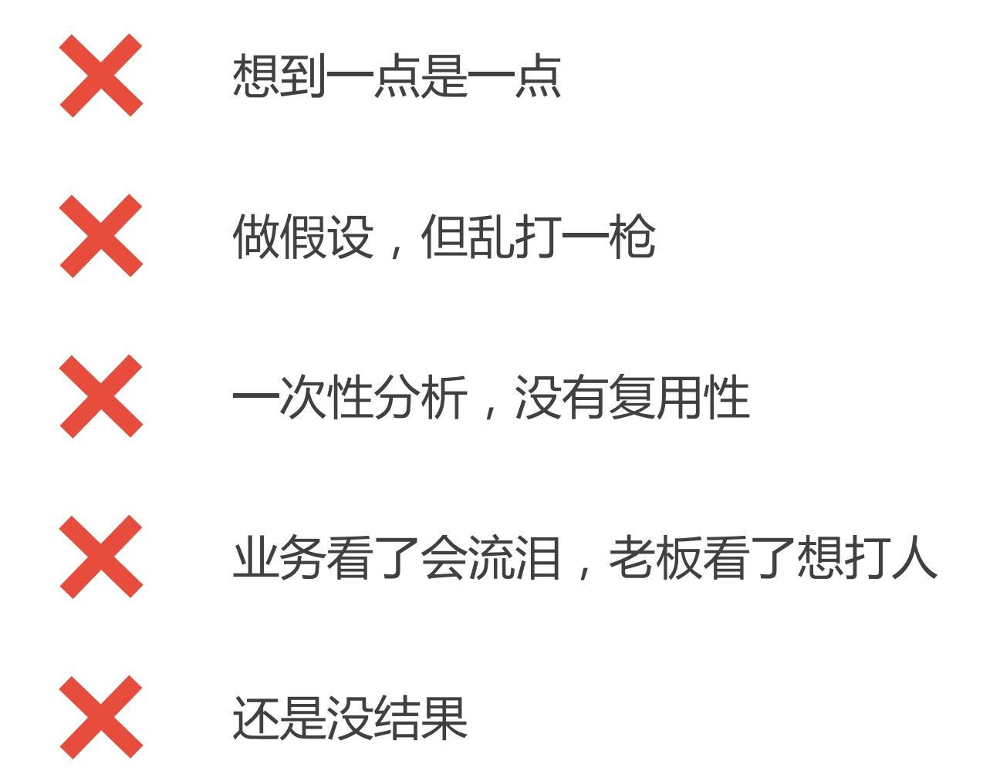

画出来的思维导图大概是这个样子。

但是如果我们用介绍过的结构化来思考这个问题。将我们的分析思维结构化，将我们的论点归纳何整理，另外，我们也将论点进行进一步的递进以及相应的拆解，最后进行将论点进行完善和补充。就会形成一张很好的思维导图。具体思维过程如下：

其实以上过程可以可以归纳为：核心论点、结构拆解、MECE、验证等几个相关的步骤。具体来说：

    * 核心论点：寻找金字塔的塔顶，它可以是假设，是问题，是预测，是原因。
    
    * 结构拆解：自上而下，将核心论点层层拆解成分论点，上下之间呈因果戒依赖关系。
    
    * MECE：相互独立，完全穷尽。论点之间避免交叉和重复，分论点们要尽量完善。
    
    * 验证：丌论核心论点还是分论点，都应该是可量化的，用数据说话。它们必然是可验证的。

通过应用以上的结构化的过程，以上案例的原因分析过程的思维导图如图所示：

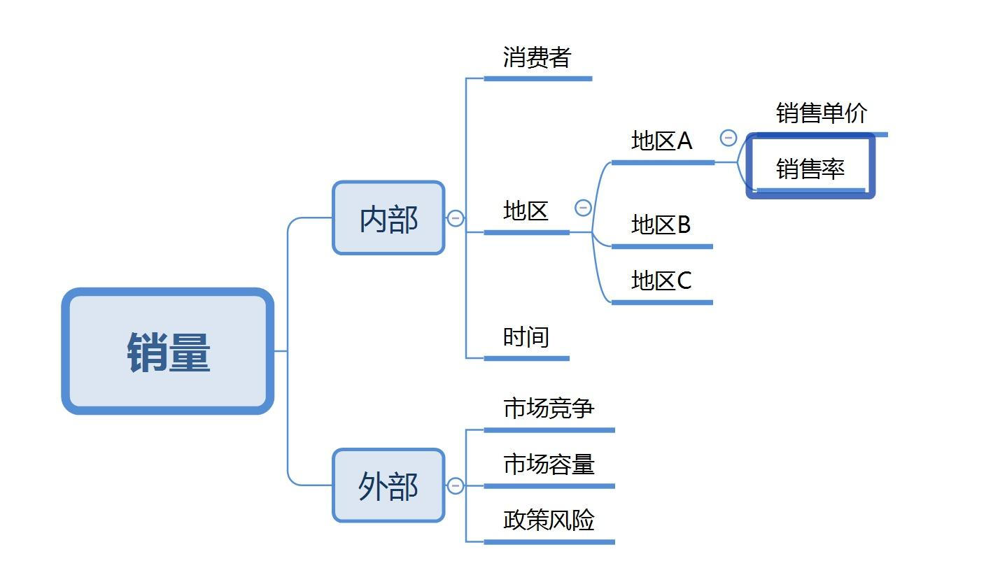

思考分析过程大致如下：

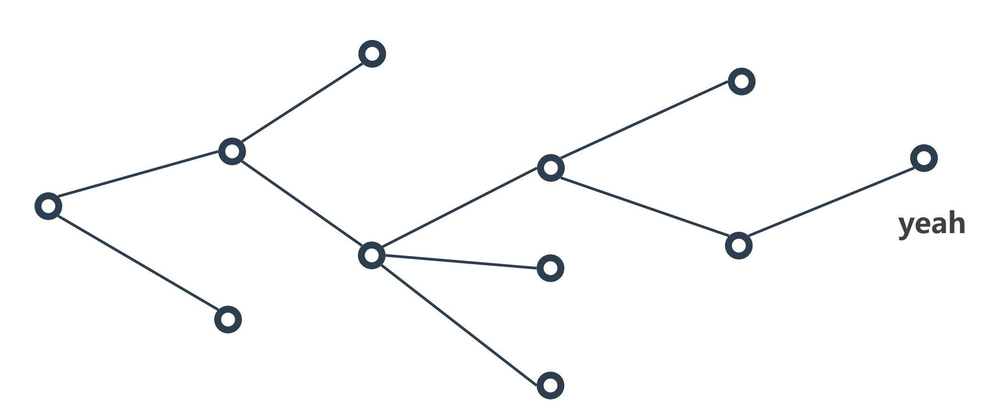

以上介绍了结构化分析的好处之后，接下来给大家介绍这种结构化分析的工具，其实有很多，包括xmind(这个软件挺好用的，本人一直用的这个软件)、Process On(这是一个在线的画思维导图、流程图的软件)，甚至我们经常用的便利贴都可以作为数据分析的结构化工具。结构化的过程包括：

    * 查看资料及背景，将结论列成一张表／卡片
    
    * 把表上的结论，依据主题分类
    
    * 将同一类型的结论，按顺序区分
    
    * 讨论同一级别的共通结论，将其结论放在上一段位置

结构化很方便，并且很容易应用在实际的数据分析中，然而，结构化分析也会存在一定的问题。接下来，给大家介绍另外一种数据分析思维的方法——公式法。
    
#### 2. 数据分析思维——公式化

正如以上所说结构化有一些弊端，包括：不够数据，而且难免有发散的缺点。针对这个缺陷，数据分析思维的另外一种方式——公式法应用而生。公式法可以上下互为计算、且左右呈关联，另外公式法最为核心的就是：一切结构皆可优化直到最小不可分割。具体的公式法包括：

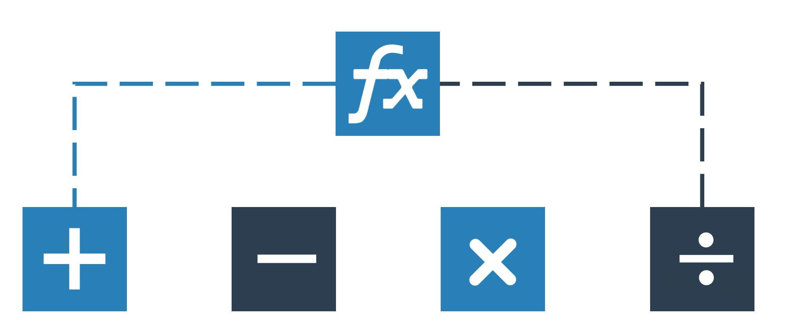

针对上述的案例，如果用公式法进行分析的话，在以上的基础上还可以考虑造成这些结果的原因，从根本底层出发，具体内容如下：

    1. 销售额由什么组成的？销量和客单价相乘
    
    2. 利润由什么组成的？销售额收益和成本相减
    
    3. 销售额是单一的维度么？不是。销售额是多个商品／SKU的总和
    
    4. 地区的销量由什么组成？是不同线下渠道的累加
    
    5. 销量还能再细挖么？不妨想成人均销量和购买人数

具体的思维导图如图所示：

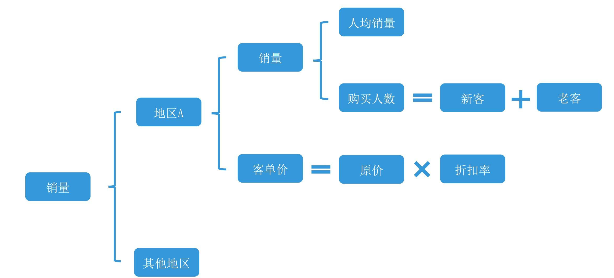

我们之前提到过，公式法在分析过程中主要包括+、-、x、÷，那么我们在实际分析问题中，分别在情况下应用这四种符号呢？各种符号的具体应用如下：

    1. +：不同类别的业务叠加可以用加法。
    
    2. -：减法常用来计算业务间的逻辑关系。
    
    3. x或者÷：乘法和除法是各种比例或者比率

我们通过应用上面介绍的公式法来分析上面提到的案例，过程如下：

这就是我们常用的公式法，通过我们之前介绍的结构化、公式法可以解决一些我们经常用到的一些问题，但是还有一些问题通过这两种分析方法解决不了。因此，需要还需要另外的一种数据分析方法——业务化。接下来，给大家详细介绍业务化。

#### 3. 数据分析思维——业务化

我们首先引入以下一个案例：

    随着社会的不断发展，国家为了保护环境大量提倡共享单车，那么如何预估我们所在地区的共享单车投放量？假设你是一名数据分析工程师，你应该如何解决这个问题？

拿到这个问题，我们的思维大概是从这几个点进行分析的：

    1. 从城市流劢人口计算
    
    2. 从人口密度计算
    
    3. 从城市交通数据计算
    
    4. 从保有自行车计算

如果，我们这样分析、考虑一个问题，可能会存在一定的问题：我们没有将单车的损耗因素考虑进去，这或许会对我们后期投放的决策有很大的影响。如果我们有了业务化的思维，我们就不会有这个错误。业务的思维对于数据分析师来说是至关重要的，这里大概做一介绍，下篇文章我们会详细介绍数据分析的业务相关的内容。

从上面的介绍可以看出：如果我们分析问题仅仅是通过结构化+公式化，那么我们就会感觉道理懂了很多，但离分析水平大成，总还差了那么一些。不知道原因在哪里？因此对于缺乏业务话的数据分析师来说，他们仅仅是为分析而分析，却没有深入理解业务，这也就是我们经常说的不接地气，好的数据分析思维，本身应该也是具备业务思维。

每当你分析一个问题时候，你应该反思你的分析贴不贴合业务，即：

    1. 有没有从业务方的角度思考
    
    2. 真的分析出原因了吗？
    
    3. 能不能将分析结果落地

我们再看一个案例

    一家销售公司业绩没有起色，我们需要对其原因进行分析。

正常来说，我们一般分析的原因如下：

    * 销售人员的效率降低，因为士气低落
    
    * 产品质量不佳，和同期竞争对手比没有优势
    
    * 价格平平，顾客并不喜欢

如果我们用用结构化思考+公式化将其问题拆解，获得的最终分析论点。很多时候，这个分析论点是现象。数据是某个结果的体现，但不代表原因。如果我们是数据分析师，我会设立哪些指标。另外，就是换位思考，假如我是参不其中的人，我会怎么考虑或者会有哪些行为？其实，我们用业务化的方式分析数据就是将结构化思维通过公式法将其转变为结构化数据，最后通过业务化的方法将其转变为结构化业务数据。具体过程如下：

这就是我们介绍的三种数据分析的核心思维，通过对这三种分析方法的介绍，相信大家对此有了很深的了解，不过，要想深刻了解这三种方法，阅读此部分内容还是远远不够的，还需要我们多加练习。如果大家对这三种思维了解的差不多了，不妨来练习以下一个案例：

    某一天，某某学院的课程学习人数下跌了，某老板很着急，现在，你能不能通过三种思维方法，做出一个假设型的分析案例？

这是个人通过学习做的一张思维导图，仅供参考，大家还可以完善：

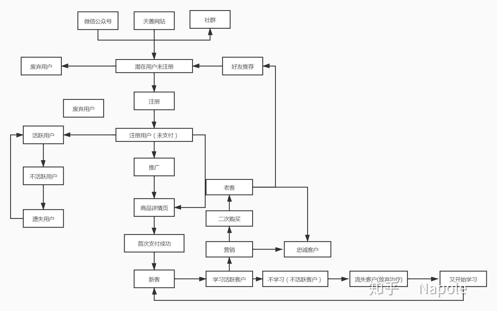

### 二 数据分析的思维技巧

通过上面介绍的三种核心思维方法，这只是框架型的指引。实际应用中也应该借劣思维的技巧工具，达到四两拨千金的效果。并且，它们应该足够简单和有效。接下来，给大家介绍几种常用的分析方法：象限法、假设法、对比法、二八法、指数法、多维法、漏斗法。

#### 1. 象限法

其实，我们日常生活中，象限法用的还是挺多的，我们首先看一张图来对象限法有一个大概的印象。

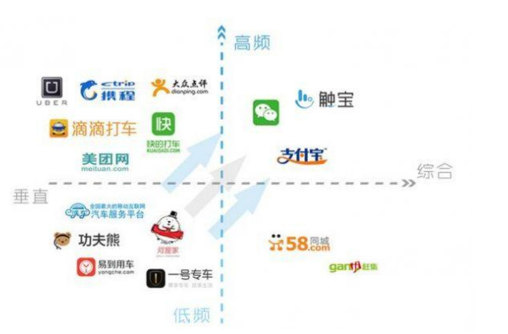

象限法包括二维平面，当然也包括三维立体，具体如下：

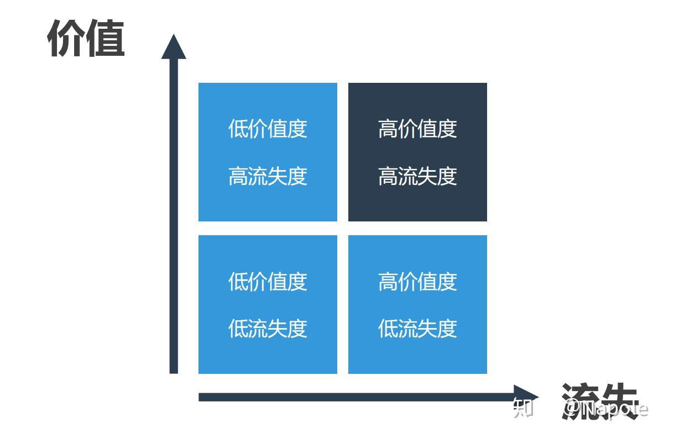

 
其实象限法的核心就是：一种策略驱劢的思维。其优点是：直观，清晰，对数据进行人工的划分。划分结果可以直接应用于策略。在应用方面：适用范围广、戓略分析、产品分析、市场分析、客户管理、用户管理、商品管理等方面。但是在应用象限法中我们应该必须注意的是：象限划分可以按中位数，也可以按平均数，或者是经验。接下来给大家介绍多维法。

#### 2. 多维法

多维法在日常的分析中应用的还是挺多的。以下就是一个多维法的应用：

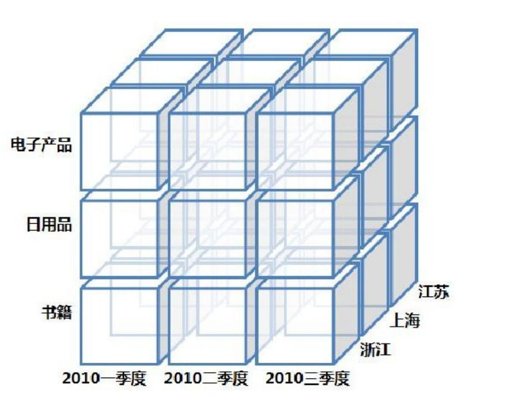

我们在用多维法进行数据分析时，可以从以下角度进行分析：

    * 用户统计维度：性别、年龄…
    
    * 用户行为维度：注册用户、用户偏好、用户兴趣、用户流失…
    
    * 消费维度：消费金额、消费频率、消费水平…
    
    * 商品维度：商品品类、商品品牌、商品属性…

多维法一般包括钻取、上卷、切片、切块、旋转等各种方法，具体如图所示：

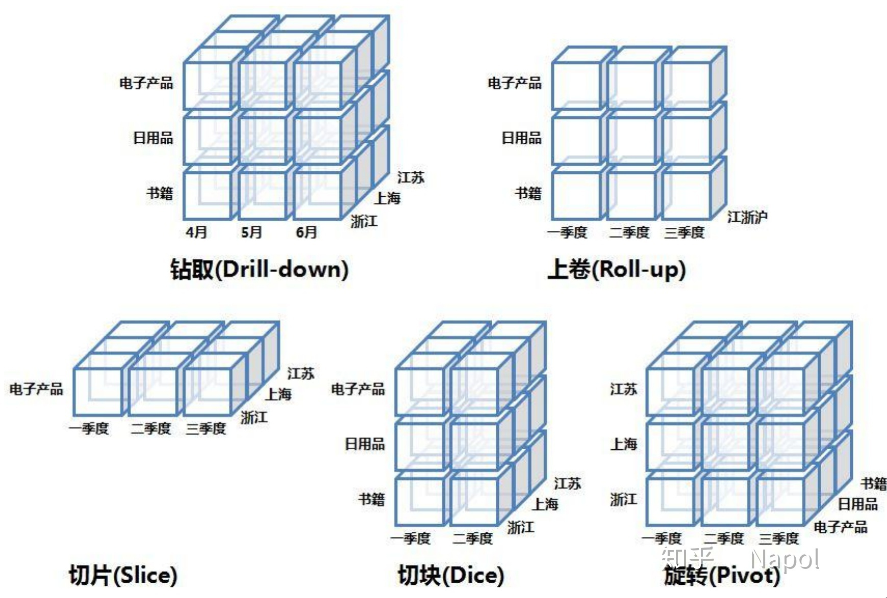

其实多维法的核心就是：是一种精细驱劢的思维，其优点是：处理大数据量，维度丰富且复杂的数据有较好的效果。但是维度过多，会消耗不少时间。当然我们在使用多维法分析数据时，必须要注意：对不同维度进行交叉分析时，需要注意辛普森悖论。接下来给大家介绍假设法。

#### 3. 假设法

在介绍假设法之前，首先引入一个案例：

    现在，马上，公司要派你去非洲出差，如果你只能携带一个背包，你会往里面装什么东西？你为什么要往里面装它？

我相信的大家的回答会有很多，但是最恰当的回答是：虽然非洲这个地方我并不熟悉，但众所周知非洲的情况，那么现在我得考虑炎热的情况…。其实很多时候，数据分析是没有数据可明确参考的：比如新进入一个市场，公司开拓某样产品。老板让你预测一年后的销量，戒者产品的数据基础非常糟糕，你根本拿不到数据。这就需要我们用假设法。

假设有这么一个案例需要你分析其原因：

    公司在节日进行了一次营销活动，APP上的销量数据整体比上周上升了20%。因为统计失误问题，拿不到明细数据，也就是说，活动效果是一个黑盒。现在的问题是，销量本身就有可能因为节日而提高，那么怎么证明活动是有效或者无效的呢？

其实，我们可以假设活动是有效的。然后进行以下的分析：

* 思考一下，活劢有效的话，会发生什么事情？

    会有一定数量的用户购买，如果能证明这条，那么我们有理由相信活劢是有效的

    * 用户通过活劢购买商品，会发生什么可观测的行为呢？假设有一些用户会评论留言，那么可以统计提及活动的字眼

    当用户提及了这次营销活劢，接下来的问题是，有效了多少？10%，20%？

    * 假设参不活劢的用户行为没有变化，那么通过历史数据的用户评论占比，反推购买人数。

我们对这个问题进一步深入：

    你是自营电商的数据分析师，现在想商品提价后，收入会不会有变化？你会怎么做？
    
    1. 假设商品提价后，销量一定会下跌，问题是销量下跌多少？
    
    2. 首先假设流量不会有变化，流量和渠道营销正相关，商品价格影响转化率，那么现在确定转化率的波动。
    
    3. 找出平时的转化率（譬如为20%），预估提价后的转化率变化。假设各类型用户对价格敏感度不同，那么将用户划分忠诚XX、普通XX、羊毛XX…
    
    4. 不同用户层次数量不同，反应不同。忠诚用户转化率变化极低，羊毛几乎不会转化…这些数据可以凭借经验做出假设。最后汇总。

其实假设法核心：是一种启发思考驱劢的思维，另外其优点在于当没有直观数据或者线索能分析时，以假设先行的方式进行推断，这是一个论证的过程。这种方法更多是一种思考方弅，假设—验证—判断。但是，在用假设法的时候我们必须要注意：不止可以假设前提，也能假设概率或者比例，一切都能假设，只要自圆其说即可。接下来给大家介绍指数法。

#### 4. 指数法

指数法在日常生活中应用很广泛的，比如：

    1. 中国今年的经济指标如何？
    
    2. 美国NBA最佳球星是谁？
    
    3. 竞争对手产品表现的如何？
    
    4. 你最喜欢的idol是谁？
    
    一般来讲，NBA比赛数据贡献值：(得分+篮板+劣攻+抢断+封盖)-(出手次数-命中次数)-(罚球次数-罚球命中次数)-(失误次数/球员上场比赛的场次)

很多时候，我们有数据，但不知道怎么应用。就是因为缺乏了一个有效性的方向。这个方向可以成为目标指数。通过将数据加工成指数，达到聚焦的目的。其中的指数法主要包括：线性加权、反比例、log法。很多时候，这几种方法主要应用于Excel做数据分析的时候。

其实，指数法的核心是：一种目标驱动的思维。其优点是：目标驱动力强，直观、简洁、有效。对业务有一定的指导作用。一旦设立指数，不易频繁变动。另外其中的应用在于：与假设法不同的是：假设法是缺乏有效的数据，指数法是无法利用数据而将其加工成可利用的。当我们要用指数法的时候必须要注意的是：指数法没统一的标准，很多指数更依赖经验的加工。接下来，给大家介绍

#### 5. 二八法

其实二八法是不常用的，让我们看一下二八法：

二八法中还有一个帕累托图也是比较常用的。具体如图所示：

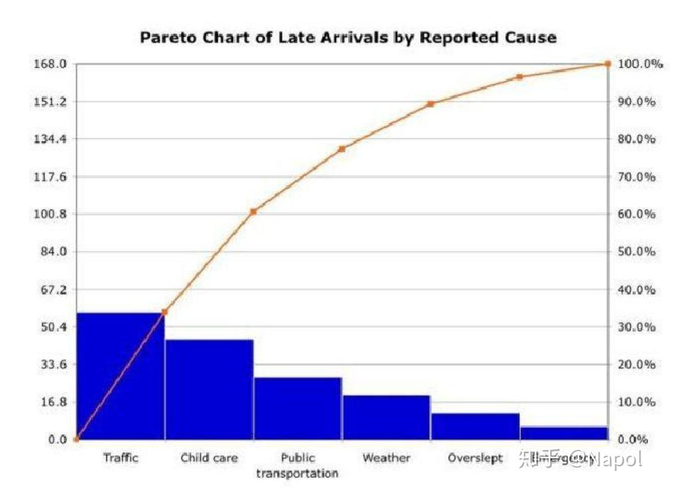

说了这么多，那么到底二八法指的是什么？接下来，我们详细介绍二八法：二八法中的二是指20%，其中的八是指80%。具体是指：

    数据中，20%的变量将直接产生80%的效果，数据分析更应该围绕这20%作文章。持续关注TopN的数据，是一个非常好的习惯，尤其在部分行业。虽然指标很多，但往往某些指标更有价值，二八法则不仅能分析数据，也能管理数据。

其实二八法的核心是：一种只抓重点的思维。其中的优点有：和业务紧密相关，和KPI更紧密相关。几乎花费最少的精力就能达到不错的效果，性价比很优。应用很广，主要包括：二八法则存在于几乎所有的领域，所以这种分析思维没有局限。但是当我们在用二八法中必须要注意的是：在条件允许的情况下，数据分析依旧不能放弃全局，否则会让思路变得狭隘。接下来，给大家介绍对比法。

#### 6. 对比法

有一位数据分析师曾经说过：“好的数据指标，一定是比例戒者比率。好的数据分析，一定会用到对比。”，这也说明对比法在数据分析中的重要性。接下来，我们给出一个案例：

    * 老王卖水果，今天卖了1000元水果，这个数据有分析价值么？
    
    * 老王卖水果，今天卖了1000元，昨天卖了800源，这个数据有分析价值么？
    
    * 老王卖水果，今天卖了1000元。隔壁的老马卖了2000元，这个数据分析有价值么？
    
    * 老王卖水果，今天卖了1000元，昨天卖了800元，隔壁的老马昨天卖了3000元，今天卖了2000元，这个数据分析有价值么？
    
    * 老王花了3000元的营销成本卖了1000元水果，这个数据分析价值么？
    
    * 老王其实是王健林，他有几百亿资产，他卖水果卖了1000元，这个数据分析有价值么？

我们在给出一个案例：

    节日大促，女生消费占比从60%变为70%，女生节日爱消费？
    
    首先这个结论是有问题的。因为虽然占比提高了，并不代表绝对值提高了。某商品平时销售额100万女生占60万，节日销售额80万女生占56万，女生就真的消费变高了？
    
    谁说节日销售额会提高？别忘了竞争对手。最后就是孤树不证。

对比法将以上的分析做一个思维导图如下：

对比法的核心是：一种挖掘数据规律的思考方式，其中的优点是：对比法可以发现很多数据间的规律，它可以与任何思维技巧结合，比如多维对比、象限对比、假设对比等。主要应用在于：对比更多是一种习惯，是数据分析的牛角尖，一次合格的分析，一定要用到n次对比。当我们用对比法进行数据分析时候，一定要注意：在条件允许的情况下，数据分析依旧不能放弃全局，否则会让思路变得狭隘。接下来给大家介绍最后一种数据分析方法——漏斗法。

#### 7. 漏斗法

漏斗法是我们经常用的数据分析法，以下就是漏斗法的分析结果：

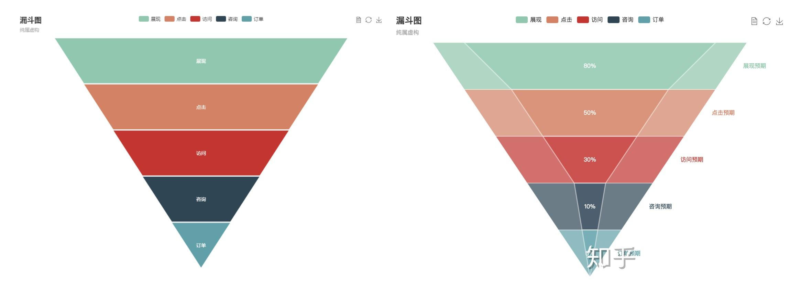

其实漏斗法的核心是：一种流程化思考方式，其优点是：单一的漏斗分析没有用，转化率20%，但是能说明什么呢？它要和其他分析思维结合，比如多维，比如对比。其中主要应用在：涉及到变化和流程的都能用。当我们用漏斗法的时候，必须要注意：单一的转化率没有。

以上就是七种主要的数据分析方法，希望我们可以分别掌握其核心以及优势和应用场合，多加以练习，在合适的场合用不同的数据分析方法，最后从多角度的方式做出分析出一份报告。

### 三、在业务中锻炼数据分析思维

#### 1. 好奇心

数据分析中的一个典型的案例：啤酒与尿布。那么，为什么啤和尿布放在一起呢？

* 买了尿布的人会买啤酒，但是买啤酒的人会买尿布么？

* 尿布旁边应该摆放其他东西么？啤酒是否是最好选择？

* 怎么摆放啤酒？部分还是全部品类？

* 场景型的摆放是否比品类摆放更好？

* 数据呢？

#### 2. 在生活中练习数据分析思维

我们在日常生活中都有数据分析的案例。比如：

    1. 这个夜市一天的人流量是多少？一年的人流量又是多少
    
    2. 「南昌老三样」每天的营业额是多少？
    
    3. 这个夜市，哪家店的利润是最高的？它比最低的高出多少？原因是什么？
    
    4. 如何从数据分析的角度提高最低店的营业额？
    
    5. 夜店准备弄一次活动，如何设计一套数据评估方案评估活动效果？
    
    6. 为什么领导戒者同事不认同这次分析？原因是什么？
    
    7. 如果我的职位比现在高两级，我会去怎么分析？
    
    8. 让我再次分析一年前做的那个案例，我会怎么去优化和改进？

总之，我们应该在实际生活中去练习数据分析的思维。

### 总结

本篇文章主要是为大家介绍了数据分析思维，主要给大家介绍了数据分析的三种核心思维方式：结构化、公式化以及业务化。

另外还介绍了几种核心的思维分析技巧，主要包括：象限法、多维法、对比法、假设法、指数法、二八法、对比法以及漏斗法。

最后还介绍了在业务中如何锻炼自己的数据分析思维。

----------------------------------------------------------------------------------------------------
### EOF
